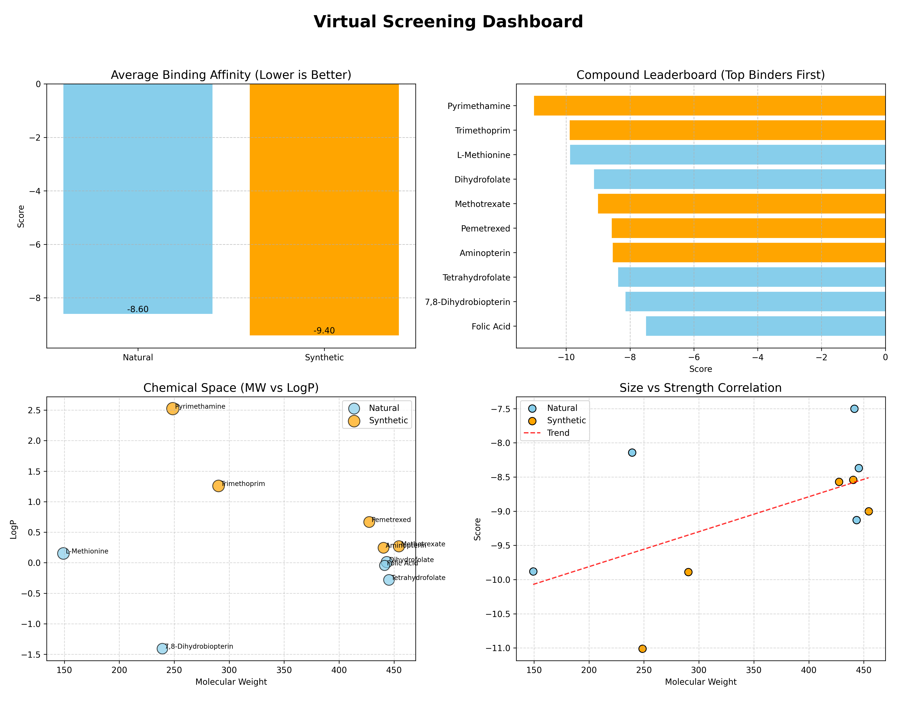

# 🧬 Virtual Screening Data Pipeline


A computational drug discovery pipeline that automates the retrieval, processing, and analysis of chemical potential drug candidates. This project compares **Natural Substrates** vs. **Synthetic Inhibitors** to analyze binding affinity trends.


## 🚀 Key Features

*   **Automated Data Retrieval**: Fetches real-time chemical data (SMILES, Molecular Weight) from the **PubChem PUG REST API**.
*   **Cheminformatics**: Calculates key molecular descriptors like **LogP** (Lipophilicity) using **RDKit**.
*   **Database Management**: Stores structured data in a local **SQLite** database (`results.db`).
*   **Virtual Screening Simulation**: Simulates docking scores to model binding affinity.
*   **Visualization**: Generates a professional dashboard comparing Natural vs. Synthetic compounds.



## 🛠️ Tech Stack

*   **Python 3**
*   **RDKit**: For molecular descriptor calculation.
*   **Pandas & Matplotlib**: For data analysis and visualization.
*   **SQLite**: For lightweight relational database storage.
*   **PubChem API**: For chemical data sourcing.

## 📦 Installation

1.  **Clone the repository**
    ```bash
    git clone https://github.com/yourusername/virtual-screening-pipeline.git
    cd virtual-screening-pipeline
    ```

2.  **Install dependencies**
    ```bash
    pip install -r requirements.txt
    ```

## ⚡ Usage

### 1. Run the Pipeline
Execute the main script to fetch data, calculate properties, and populate the database.
```bash
python3 main.py
```
*Output: Creates `results.db` and exports `natvssynt.csv`.*

### 2. Generate the Dashboard
Create the visualization suite to analyze the results.
```bash
python3 visualization.py
```
*Output: Generates `dashboard.png`.*

## 📊 Data Analysis

The pipeline analyzes two distinct groups:
1.  **Natural Substrates** (e.g., Folic Acid, Dihydrofolate)
2.  **Synthetic Inhibitors** (e.g., Methotrexate, Pemetrexed)

**Hypothesis**: Synthetic inhibitors are designed to bind more tightly (lower score) than natural substrates. Check the "Avg Score by Type" graph to verify!

## 📝 SQL Exploration

Want to query the database directly?
```sql
-- Find the top 3 strongest binders
SELECT name, score FROM screening_results ORDER BY score ASC LIMIT 3;
```
*(See `sql_queries.md` for more examples)*


